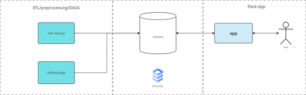
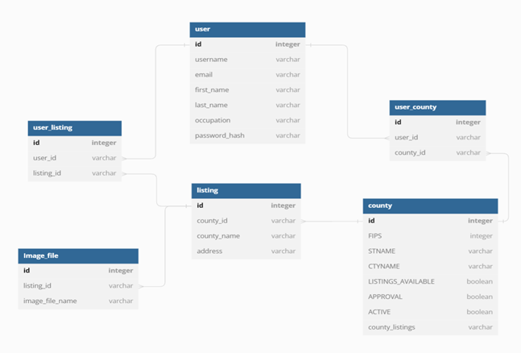

## Real Estate Listing Flask App (relist)

This project contains the codebase for a real estate listing Flask web app prototype build. It comprises of a frontend service with user login/sessions and the models for a supporting relational database design using SQL Alchemy models/objects. The backend service contains basic commit logic to initialize the database. The project has deployment scripts ready for Google Cloud Kubernetes Engine and CloudSQL.

### System Diagram

### Relational Database Schema

